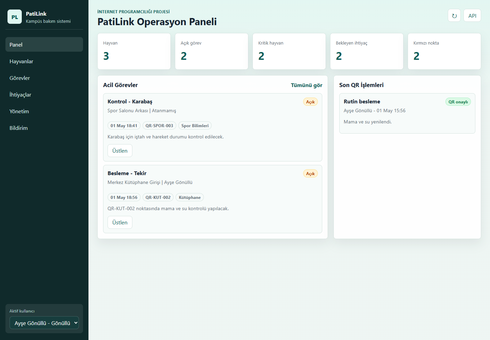
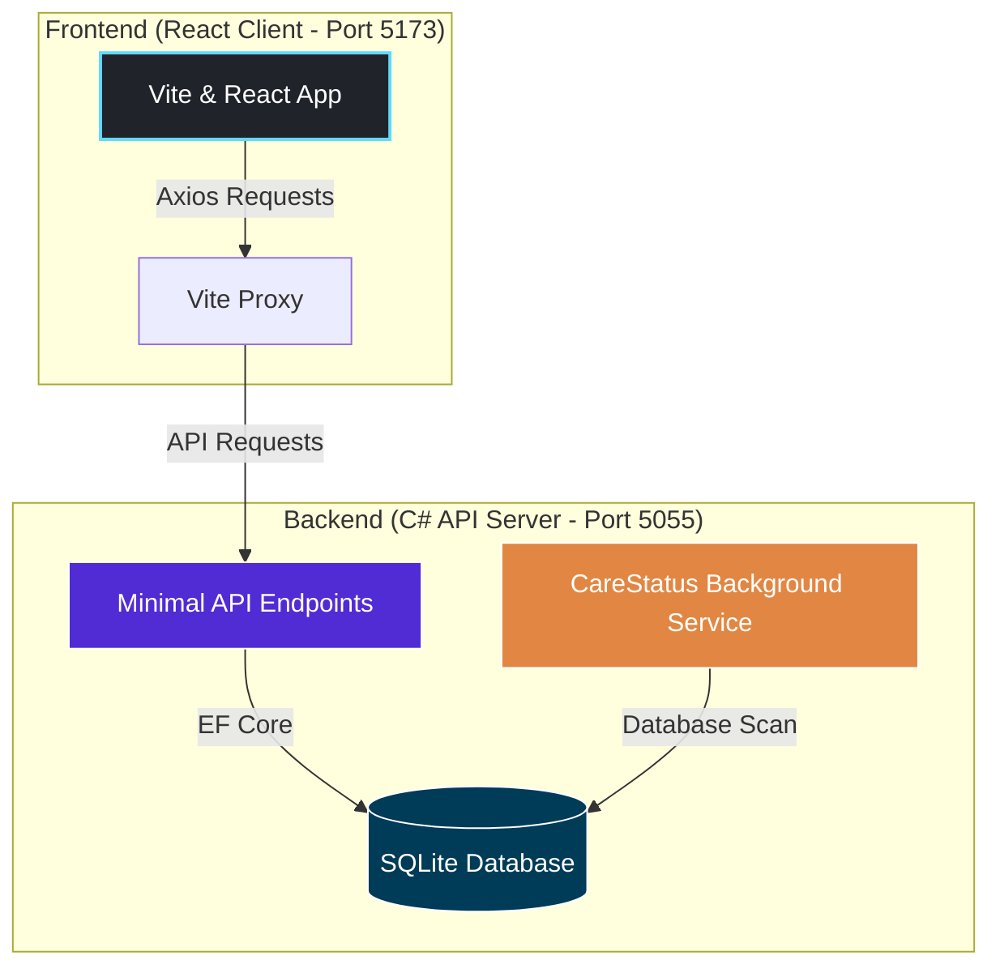

# 🐾 PatiLink - Campus Stray Animal Care & Task Coordination System

> An elegant, secure, and modern web application developed for campus stray animal care coordination. Featured as a university course term project.

<p align="center">
  
  
  
  
  
</p>

---

## 📋 Table of Contents
- [About the Project](#-about-the-project)
- [Key Features](#-key-features)
- [System Architecture](#-system-architecture)
- [Technology Stack](#-technology-stack)
- [Project Directory Structure](#-project-directory-structure)
- [Setup and Run](#-setup-and-run)
- [Demo Users & QR Codes](#-demo-users--qr-codes)
- [API Endpoints](#-api-endpoints)
- [License](#-license)

---

## 📋 About the Project

PatiLink digitalizes and coordinates care processes for stray animals living on university campuses. Built with a responsive React frontend and a fast ASP.NET Core Minimal API backend, it connects volunteers, campus veterinarians, and administrators to ensure that no animal is left without water, food, or medical attention.



---

## 🏗️ System Architecture

Below is the high-level system architecture showing how the client, backend API, database, and background services interact:



---

## ✨ Key Features

- 🐱 **Animal Directory**: Dynamic catalog with filtering options (by campus location, urgency, status).
- 📍 **Interactive Location Map**: Leaflet.js-powered campus map showing live feeding points. Markers dynamic color shift (green for routine, pulsing red for hungry/urgent).
- 📱 **Smart Location-Verified QR System**: Volunteers scan physical QR codes at feeding points using their mobile camera. The system checks location validity and highlights tasks on screen, preventing remote task manipulation.
- ⏰ **6-Hour Care Policy**: An integrated backend background service scans data every 15 minutes, automatically shifting care status to "Hungry" if 6 hours have passed since last feeding.
- 🏥 **Health & Medical Records**: Dedicated panels for veterinarians to document check-ups, vaccines, and treatments, automatically triggering follow-up tasks.
- 📦 **Need & Donation Tracking**: Real-time listing of items needed (food, medication, dog beds) and tracking of volunteer donation commitments.
- 🔐 **Secure Role-Based Access Control**: Standard JWT authentication protecting APIs according to roles (`Admin`, `Vet`, `Volunteer`).

---

## 🛠️ Technology Stack

### Backend
*   **.NET 8 (ASP.NET Core)** — Minimal API framework for lightweight, fast endpoints.
*   **Entity Framework Core (EF Core)** — Code-First ORM supporting relational modeling.
*   **SQLite** — Default embedded database for easy setup (SQL Server option available in settings).
*   **JWT Bearer Authentication** — Secure token-based user sessions.
*   **BCrypt.Net-Next** — Modern password hashing.
*   **Hosted Service (BackgroundService)** — Scheduler for the 6-hour status checker.

### Frontend
*   **React 19** — Powered by **Vite** for fast, optimized hot-reloads.
*   **Tailwind CSS v4** — Utility-first styling with modern native HSL palettes and custom transitions.
*   **React Router v7** — Declarative routing with guard components.
*   **Leaflet & React Leaflet** — Interactive maps based on OpenStreetMap.
*   **React QR Scanner** — Camera-based QR decoding.
*   **Lucide React** — Premium icon set.

---

## 📂 Project Directory Structure

```
patilink/
├── server/                        # Backend API (C#)
│   └── PatiLink.Api/
│       ├── Data/
│       │   ├── PatiLinkDbContext.cs    # EF Core context class
│       │   └── DbSeeder.cs             # Automatic demo data seed logic
│       ├── Models/
│       │   └── PatiLinkModels.cs       # Data schema & DTO definitions
│       ├── Services/
│       │   └── CareStatusBackgroundService.cs  # 6-hour care rule scheduler
│       ├── Program.cs                  # Config and API routing endpoints
│       └── appsettings.json            # DB & JWT configurations
├── client/                        # Frontend (React)
│   └── src/
│       ├── api/
│       │   └── apiClient.js            # Axios middleware & headers configuration
│       ├── components/
│       │   ├── Navbar.jsx              # Responsive, role-based navigation bar
│       │   ├── Footer.jsx              # Footer details
│       │   └── ProtectedRoute.jsx      # Route guardian checks
│       ├── contexts/
│       │   └── AuthContext.jsx         # Global context for active sessions
│       ├── pages/
│       │   ├── Home.jsx                # Summary metrics and quick alerts
│       │   ├── Animals.jsx             # Animal index page
│       │   ├── AnimalDetail.jsx        # Detail, health logs, and tasks
│       │   ├── Needs.jsx               # Needs board
│       │   ├── Donations.jsx           # Donation tracker
│       │   ├── HealthLogs.jsx          # Veterinary logs
│       │   ├── FeedingPoints.jsx       # Map-based location organizer
│       │   ├── Contact.jsx             # User reports
│       │   ├── VolunteerPanel.jsx      # Simulation of camera scan
│       │   └── AdminPanel.jsx          # Admin settings
│       ├── App.jsx                     # Route settings
│       └── index.css                   # Tailwind CSS tokens
├── docs/                          # Schema & documentation notes
└── README.md
```

---

## 🚀 Setup and Run

### Prerequisites
*   [.NET 8 SDK](https://dotnet.microsoft.com/download)
*   [Node.js 18+](https://nodejs.org/)

### 1. Launch the Backend API
```bash
cd server/PatiLink.Api
dotnet run
```
*   The server will start by default at `http://localhost:5055`.
*   A `PatiLink.db` file will be created locally on first run and populated with rich sample data automatically.
*   *Security Note:* A development secret key is defined in `appsettings.json`. Replace it with a secure environment variable key in production.

### 2. Launch the React Frontend
```bash
cd client
npm install
npm run dev
```
*   The web app will run locally at `http://localhost:5173`.
*   API requests are automatically proxied to the backend via Vite config.

---

## 👤 Demo Users & QR Codes

### Test Accounts
You can test the different access control levels using the following credentials:

| Email | Password | Role | Access Level |
|---|---|---|---|
| `admin@patilink.edu.tr` | `123` | Admin | Full control over locations, animals, and logs |
| `vet@patilink.edu.tr` | `123` | Veterinarian | Can log health reports and bypass QR codes for medical tasks |
| `gonullu@patilink.edu.tr` | `123` | Volunteer | Can assign themselves to tasks and resolve them via QR scan |

### QR Code Simulation
In the Volunteer Panel, you can simulate camera input by inputting these codes corresponding to local points:

| QR Code Identifier | Physical Location Point |
|---|---|
| `QR-ENG-001` | Faculty of Engineering |
| `QR-LIB-002` | Behind the Library |
| `QR-SPO-003` | Sports Hall |

---

## 🔌 API Endpoints Reference

### Authentication
*   `POST /api/auth/register` — Standard user registration.
*   `POST /api/auth/login` — Login (returns JWT Token).

### Animals
*   `GET /api/animals` — Retreive animal list (supports query parameters).
*   `GET /api/animals/{id}` — Retrieve detailed record.
*   `POST /api/animals` — Create a new entry (*Admin/Vet only*).
*   `PUT /api/animals/{id}` — Update animal profile (*Admin/Vet only*).
*   `DELETE /api/animals/{id}` — Remove animal profile (*Admin only*).

### Tasks & Care
*   `GET /api/tasks` — List care duties.
*   `POST /api/tasks` — Create task duty.
*   `PATCH /api/tasks/{id}/assign` — Connect task with active volunteer.
*   `POST /api/tasks/{id}/complete` — Finish task (validates location QR code).

### Needs & Donations
*   `GET /api/needs` — List needed items.
*   `POST /api/needs` — Register new campus need.
*   `PATCH /api/needs/{id}/status` — Modify need status.
*   `GET /api/donations` — Retrieve donation logs.
*   `POST /api/donations` — Record new donation commitment.

---

## 📄 License

This project is licensed under the MIT License - see the [LICENSE](LICENSE) file for details. Developed as a term project.
